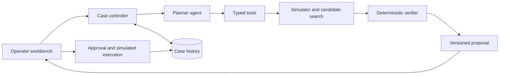

# Conjunction Decision Desk — Track Decision and Product Plan

**Status:** Draft for team review. Research and planning only; implementation has not started.

**Updated:** 12 September 2026, after confirmation of three builders and a twenty-hour event.

**Build approach:** Selective reuse of suitable licensed components, plus a small original verification and agent workflow. No pre-event implementation is assumed.

**Research companion:** [GitHub and hackathon evidence](</C:/Users/Utkarsh/Desktop/Project/GDG bit to build/research.md>). Fourteen repositories checked; selected source files inspected in seven. No repository was installed or run.

**Recommended problem statement:** Space Tech & Orbital Sustainability, specifically satellite maneuver planning.

**Product:** An agentic workbench that investigates close approaches, evaluates maneuver alternatives, catches secondary conflicts, and produces a reviewable decision package. Demonstrate the complete workflow in a disclosed orbital simulation.

## 1. The revised decision

Keep **Space Tech & Orbital Sustainability** as a narrowly scoped, higher-risk competitive choice for **three builders in twenty hours**. The previous thirty-six-hour scope is superseded.

The product is a **Conjunction Decision Desk**: one three-object scenario, a finite maneuver search, one live tool-using planner agent, a deterministic verifier, and an operator decision/export flow. Our signature is a maneuver that fixes the original encounter but creates a secondary conflict, which the verifier catches before the agent replans.

The recommendation depends on a teammate owning and explaining the numerical core. Without that owner, a small Supply Chain Circularity negotiation workflow is the safer completion choice. We cannot infer numerical experience from access to coding assistants.

Research supports both plausibility and existing competition. SpaceGuardian won first place at the 8th CASSINI Hackathon for a closely related concept. Existing public repositories also overlap substantially with our proposal, so a tracker with AI commentary is not sufficient differentiation. [EUSPA results](https://www.euspa.europa.eu/newsroom-events/news/8-cassini-hackathon-winners)

**Rename:** the previous working name, OrbitGuard, is already used by a close GitHub precedent. “Conjunction Decision Desk” is a descriptive working label, not a cleared brand. [Existing OrbitGuard](https://github.com/Nishant7p/OrbitGuard)

The competitive argument is a complete, inspectable decision loop that survives a live constraint change. There is no claim of guaranteed victory or worldwide novelty.

## 2. Confirmed constraints and remaining assumptions

### Confirmed

- **Three people will build; the event lasts twenty hours.**
- Approximately 60–80 teams, with two winners across all tracks.
- Six judging criteria, with no numerical weights supplied.
- One ChatGPT Plus subscription and two Claude Pro subscriptions.
- Organizers have told you synthetic data and online sources are permitted.
- You want to use existing GitHub work for inspiration and to reduce implementation time.
- Current authorization is research and planning; product implementation has not started.

### Still unconfirmed

- Event URL and exact rules for third-party code, starters, pre-event work, deployment, and submission.
- Which teammate can own Python/numerical work and which frontend stack the team already knows.
- Runtime model/API access and spending budget.
- Demo duration; the presentation below assumes three minutes.

Research and planning can continue now. During the future build, reuse only components allowed by their licenses and the event rules. Permission to use online data does not by itself establish permission to submit an existing application. The schedule counts all implementation, setup, and integration within the twenty hours.

## 3. Comparison of all eight tracks

These are qualitative assessments of **narrow hackathon products** for three builders in twenty hours, not judgments about the importance of the underlying problems. Execution means feasibility of a credible finished demo; usability means how readily the scoped product delivers value. There is no invented weighting or win probability.

| Track and plausible scope | Impact | Innovation opportunity | Agentic fit | Execution feasibility | Usability | Demo potential | Main obstacle |
|---|---|---|---|---|---|---|---|
| Space: small maneuver planning and verification workflow | High | High | High | Medium–Low | Medium | High | Numerical ownership, integration time, and honest evidence |
| Circularity: constrained byproduct matching and negotiation | High | High | High | High | High | Medium | Material compatibility and buyer acceptance need domain evidence |
| Privacy: exposure investigation and remediation cases | High | Medium | High | Medium | High | High | Reliable identity matching and externally controlled removals |
| Civic: one municipality's evidence-linked impact reports | High | Medium | High | High | High | Medium | Can resemble document summarization unless actions and uncertainty are strong |
| Agriculture: storage and transport negotiation for one crop | High | Medium | High | Medium | High | Medium | Local prices, capacity, and farmer access are difficult to validate |
| Energy: simulated micro-grid dispatch and trading | High | High | High | Low–Medium | Medium | High | Grid physics, settlement, and deployment constraints |
| Maritime: a bounded route/encounter planning tool | High | High | High | Low–Medium | Medium | High | Vessel data quality and fuel-model credibility |
| Bio-acoustics: detection followed by response coordination | High | High | High | Low | Medium | High | Detection robustness and evidence that a response helps ecology |

Space remains the higher-upside recommendation only with the reduced scope and early feasibility gates. Circularity has the stronger completion case at twenty hours. Civic is also attractive when completion certainty matters most. None of the other tracks should be dismissed as inherently unwinnable.

**Unknown track occupancy has no weight in this comparison.** A popular track can still produce the best submission; an empty track gives no category advantage when winners are selected overall.

## 4. Stress-testing the team's two favourites

### Space: the opportunity and the trap

The problem is substantial: ESA's statistics, updated 31 July 2026, list approximately 46,780 regularly tracked space objects. That count includes active spacecraft; it is not a count of debris alone. [ESA statistics](https://sdup.esoc.esa.int/discosweb/statistics/)

Synthetic data is an advantage for repeatable experiments. It lets us stage rare encounters, change constraints live, and compare outcomes under identical inputs. It does not remove the need for correct units, consistent dynamics, plausible initial conditions, and transparent assumptions.

Nor is this an untouched commercial field. Kayhan's Pathfinder documentation describes conjunction assessment, maneuver planning, secondary-conjunction checks, and operator coordination. We should acknowledge that overlap directly. [Pathfinder documentation](https://app.kayhan.io/docs/pathfinder/)

Our proposed distinction is a transparent, reproducible workbench for investigating how mission constraints change a decision, with tool evidence attached to every recommendation. This is an implementation focus and an adoption hypothesis, not a claim that nobody has built anything similar.

### Privacy: simpler interface, harder outcome

A polished scan-and-report interface would be relatively straightforward. A complete privacy agent also needs to distinguish people with similar names, obtain authority to act, handle site-specific processes, track responses, and verify that exposure actually disappeared.

Incogni already describes scanning, automated removal requests, repeated requests, and progress tracking. That establishes existing competition; it does not establish how many teams will choose privacy at your event. [Incogni workflow](https://incogni.com/)

Have I Been Pwned offers breach APIs, but authenticated account searches generally need the appropriate subscription. Its test facility supports integration testing, not unrestricted real-person searches. Breach discovery is also a different problem from removing an exposed record. [HIBP API documentation](https://haveibeenpwned.com/API/v3)

A legal request is not proof of removal. For example, UK guidance describes a conditional right to erasure and response times generally extending beyond a hackathon. That is a jurisdiction-specific example, not an assertion that UK rules apply to Indian users; the guidance itself is under review. [ICO guidance](https://ico.org.uk/for-organisations/uk-gdpr-guidance-and-resources/individual-rights/individual-rights/right-to-erasure/)

If we selected privacy, the stronger concept would be a consent-based **exposure case manager** for a specific user group: evidence collection, identity disambiguation, appropriate remediation drafts, status tracking, and verified rechecks on supported sources. A controlled test site could demonstrate removal, visibly labeled as a test. We must never equate a sent request with a completed deletion.

**Decision under the now-confirmed time limit:** the reduced space workflow is defensible if a numerical owner is available. Privacy is preferable if the team already has a distinctive, working security integration; starting broad scanning and real removals from scratch also creates substantial twenty-hour risk.

## 5. Product definition

**Working label:** Conjunction Decision Desk. The former name, OrbitGuard, has been retired because of a close existing GitHub project.

**One-sentence pitch:** “Conjunction Decision Desk turns a satellite close-approach alert into a mission-aware maneuver proposal, tests its consequences, and gives the operator an auditable decision.”

**Primary user hypothesis:** A mission analyst working with a maneuver-capable small satellite. An initial accessible pilot audience is university mission teams using it for planning exercises and scenario review. Do not assume all small satellites have propulsion.

**User problem:** An alert is only the beginning. The analyst needs to investigate data quality, understand constraints, compare actions, check consequences, and explain the eventual decision.

**Hackathon promise:** A user can load a scenario, set mission constraints, run the agent workflow, inspect alternatives, approve a simulated maneuver, and export the complete evidence package.

**Meaning of complete:** Every step in that scoped workflow works. It does not mean the software is qualified to control an operational satellite.

### Three approaches considered within the space track

| Approach | Strength | Weakness | Decision |
|---|---|---|---|
| Debris tracker with explanatory chat | Easy visual entry point | Limited decision-making and weak differentiation | Insufficient as the main product |
| Mission-aware maneuver planner with independent validation | Observable planning, tool use, replanning, and measurable results | Requires a verified numerical core | Recommended |
| Multi-operator autonomous traffic negotiation | Strong coordination story | Adds protocols, multiple maneuvering actors, and much harder validation | Reserve for after the core works |

## 6. The signature demonstration

Use fictional satellite names and a generated, physically consistent scenario:

1. **Observe:** A maneuver-capable satellite, Aster-1, is predicted to pass too close to a non-maneuvering debris object within the simulated horizon.
2. **Understand:** The user has specified a maneuver budget and a protected mission window during which burns are prohibited.
3. **Plan:** The planning agent requests candidate maneuvers and their simulated consequences.
4. **Discover a conflict:** A candidate that improves the original encounter creates a separate close approach with another object.
5. **Revise:** The agent inspects the rejection, searches supported alternatives, and selects a candidate satisfying all modeled constraints.
6. **Challenge live:** The judge reduces the maneuver budget or changes a protected window. The previous approval becomes invalid and the agent must recompute or state that it found no feasible candidate.
7. **Review:** The operator sees before/after separation, maneuver cost, rejected alternatives, and the exact inputs used.
8. **Act in simulation:** The operator approves a particular proposal version; the simulator applies it once, advances the scenario, and records the result.
9. **Export:** Download a human-readable report plus the scenario and machine-readable event record.

The narrative is planned; the numerical outcomes must be computed during implementation. Do not hardcode a successful result or force the agent to choose a known bad candidate merely for drama. If it immediately avoids the bad candidate, show that candidate's independently computed rejection as part of the comparison.

## 7. Required scope and deliberate cuts

### Required in twenty hours

- Exactly three synthetic objects: one maneuver-capable satellite, the initial threat, and a second object used to test a secondary conflict.
- One principal scenario plus failure/constraint variants.
- Explicit epoch, units, frame, model, and scenario/policy versions.
- A two-body simulator, 24 supported burn candidates plus do nothing, and final deterministic verification.
- Editable maneuver budget and protected burn windows.
- **One live planner agent** with real tools, bounded retries, visible evidence, and case memory.
- An explicit no-feasible-candidate result.
- One workbench with trajectory projection, separation chart, candidate comparison, and activity trace.
- Versioned operator approval, simulated execution, reload/reset, and JSON/Markdown evidence export.
- Required numerical and failure checks; a clearly labeled recorded fallback.

### Optional only if the complete loop passes by hour twelve

Choose at most one, with a one-hour cap: a small 3D view using the same computed trajectories, or an LLM evidence reviewer. A deterministic verifier is required regardless of whether a second agent exists.

### Cut from this event

- Live public-catalog ingestion, full-catalog screening, and multiple orbital regimes.
- Multi-operator negotiation and autonomous command transmission.
- Collision-probability estimation from bare public elements.
- New ML/RL training, a large agent framework, or a model-provider ensemble.
- Debris collection hardware, fuel-mass/lifetime claims, billing, enterprise tenancy, or a separate marketing site.
- PDF generation; use Markdown and JSON exports.

These are scope decisions for a complete constrained product, not features waiting to be squeezed into the final hour.

## 8. Physics and data credibility

### Required simulation model

Use a **two-body Earth gravity model with instantaneous burns**, in one documented Earth-centered inertial simulation frame. Propagate all synthetic objects using the same model. This is a deliberately limited short-horizon simulation; it omits drag, Earth's non-spherical gravity, finite burns, attitude constraints, and navigation uncertainty.

Use meters, seconds, and meters/second internally. Set Earth's gravitational parameter explicitly to 3.986004418e14 m³/s². Scenario states contain position, velocity, and a common epoch. Use standard numerical integration rather than language-model-generated orbit positions. SciPy provides initial-value integration through `solve_ivp`; DOP853 is a candidate method to validate for this implementation. [SciPy documentation](https://docs.scipy.org/doc/scipy/reference/generated/scipy.integrate.solve_ivp.html)

Generate encounters from coherent state vectors. One practical construction is to define a desired near encounter at a common future epoch, propagate the states backward, and then verify that forward propagation reproduces it. Store generated inputs and seeds; do not animate disconnected paths.

### Initial supported search space

- Prediction horizon: six simulated hours.
- Initial burn epochs: 15, 30, 45, and 60 minutes after scenario start.
- Burn direction: along or opposite the satellite's instantaneous velocity.
- Burn magnitudes: 0.05, 0.10, and 0.20 m/s.
- This gives 24 single-burn candidates plus a do-nothing baseline.
- Default maneuver budget: 0.20 m/s, adjustable downward by the user.
- Default modeled minimum separation: 1,000 meters from every other catalog object throughout the evaluated horizon.
- Protected mission windows prohibit burns; they do not represent a computed communications-coverage model.

These are initial **demo configuration values**, not operational thresholds or validated recommendations. Their usefulness must be checked in the first feasibility task. If changed during development, record the new configuration and regenerate the benchmarks.

Only compare feasible candidates after all constraints have been checked. Rank by minimum maneuver magnitude, then larger minimum separation, then earlier burn time. The result is the best candidate found within the supported discrete set, not a globally optimal trajectory.

When no candidate passes, say **“No feasible candidate found in the supported search set.”** Do not claim the real mission is impossible to protect.

### Close approaches and verification

- Compute separation from simultaneous positions in the same frame.
- Do not use distances between drawn orbit lines as encounter evidence.
- Detect and refine minima of squared relative separation, including interval boundaries and points around a burn.
- Include event detection for the relative-position/relative-velocity dot product, and independently check sampling/step-size convergence. A coarse animation timestep can miss a fast encounter.
- Re-screen the selected maneuver against every scenario object, including new encounters later in the horizon.
- Recompute the selected proposal with tighter numerical settings before allowing simulation approval. If convergence checks fail, withhold approval.
- Include the evaluated object count and horizon in the result. A finite-catalog check cannot establish global safety.

NASA explicitly distinguishes close-approach screening from collision-risk assessment. Conjunction Decision Desk's MVP will display simulated minimum separation and constraint status, not an invented collision probability. [NASA CARA](https://www.nasa.gov/cara/step-2-close-approach-risk-assessment/)

### Public data after the twenty-hour event

CelesTrak provides public general-perturbations data in formats including JSON and CSV using OMM keywords. A catalog integration is a later phase: request a format explicitly, use current documented endpoints, cache responsibly, and retain provenance. Public availability does not mean unlimited polling or unrestricted redistribution. [CelesTrak formats](https://celestrak.org/NORAD/documentation/gp-data-formats.php)

If added later, keep public-catalog visualization separate from synthetic maneuver validation until the appropriate transformations and checks are implemented. The maintained Python SGP4 package documents its output frame and propagation interfaces; its output must not be silently mixed with a different coordinate frame. [SGP4 package documentation](https://pypi.org/project/sgp4/)

**“Real data later” is a separate engineering phase.** Operational work would require appropriate ephemerides and uncertainty information, validated frame/time transformations, maneuverability and spacecraft constraints, a higher-fidelity propagation/assessment process, specialist review, and operator integration. Designing an input boundary now helps; it does not make that work a plug-in replacement.

## 9. Agentic design

Use **one planner agent and one deterministic verifier**. The verifier is software, not an LLM agent. A second LLM reviewer is optional and must not consume time needed for the core.

The numerical search works without an LLM. The agent contributes interpreting mission intent into a reviewed policy, choosing investigative tools, inspecting rejections, using case history, and replanning after a change. It must do more than summarize the optimizer's output.

| Component | Responsibility | Visible evidence |
|---|---|---|
| Planner agent | Inspect the case, propose policy from user intent, request candidates and checks, revise or escalate | Actual tool calls and concise decisions linked to tool results |
| Deterministic verifier | Recompute the selected trajectory and enforce current constraints against all three objects | Pass/fail, encounter minima, input versions, and numerical-check status |
| Application controller | Save events, enforce budgets, invalidate outdated proposals, apply a simulated maneuver once after approval | Case state, versioned approval, and execution record |

### Tools

- `inspect_scenario`: states, epoch, provenance, model, and validity.
- `read_policy`: current budget, protected windows, separation requirement, and version.
- `propose_policy`: structured interpretation for user confirmation; never silently relax a constraint.
- `screen_encounters`: baseline minima and encounter times.
- `evaluate_candidates`: computed maneuver costs and constraint results.
- `validate_proposal`: recompute one candidate against current inputs.
- `read_case_history`: previous attempts and rejection evidence.
- `create_decision_report`: assemble conclusions from verified fields.

Simulated execution belongs to the controller after operator approval. The agent receives no unrestricted command tool.

### State and execution limits

Persist scenario/policy versions, tool inputs/results, candidate ID, rejection reasons, model calls/usage, approval, and outcome. SQLite is sufficient; use an existing small persistence pattern if the team already knows one.

Show concise decision summaries and actual evidence, not hidden chain-of-thought or manufactured conversations. Mark recorded execution visibly.

Set a maximum of eight model calls and twelve tool calls per run, including one schema-repair attempt. Allow two replanning rounds within a sixty-second application deadline. Invalid tools, non-finite values, invented candidates, stale versions, and failed checks cannot produce an approvable proposal. Treat imported descriptions as data.

On timeout or unresolved evidence, save the case and return a specific unresolved status. Any policy/scenario edit invalidates prior validation and approval.

## 10. Implementation architecture and reuse decisions

Use the frontend stack the team already knows; React/TypeScript is the default assumption. A small Python/FastAPI service owns the numerical model, tool calls, and SQLite history. Serve the built browser assets from the same service if deployment requires it.

### Reuse first, with a clear boundary

The user explicitly prefers inspiration/reuse to reduce implementation time. Reuse is part of the baseline plan, not merely a finals idea. Do not assume a whole existing platform is faster until its setup and required behavior have been checked.

| Component/reference | Concrete use | Required limit |
|---|---|---|
| [Existing OrbitGuard candidate generator](https://github.com/Nishant7p/OrbitGuard/blob/3f0ca18fd241c0c2bbd8c0efef16e8471a3ec1b7/engine/maneuver/generator.py), MIT | Adapt the no-burn/signed-candidate structure to our small time/magnitude grid, with attribution if code is copied | Do not inherit its displacement surrogate as a validated outcome |
| [SatGuard planner](https://github.com/cesabici-bit/satguard/blob/07a86ce8c65dee49abfd540c59f049b7e4b1f874/src/satguard/maneuver/planner.py), MIT | Reuse the idea of a structured candidate/tradespace result; inspect isolated code for adaptation where it actually saves work | Avoid importing default-covariance probability claims |
| [SatGuard CW helper](https://github.com/cesabici-bit/satguard/blob/07a86ce8c65dee49abfd540c59f049b7e4b1f874/src/satguard/maneuver/cw.py), MIT | Optional estimate/reference for a circular-orbit sanity case, within its applicability envelope | Final results still come from our two-body post-burn simulation |
| NumPy/SciPy and familiar chart components | Reuse integration, numerical arrays, and ordinary chart primitives | Validate the model and encounter search, not the libraries' existence |
| Prize-linked Eye Above/Dagon interfaces | Learn selection, time navigation, and context presentation | Copy code/assets only where the applicable license permits; no obsolete infrastructure migration |
| Existing team starter | Reuse basic API/browser layout if event rules allow | Keep the original agent loop and verifier clearly attributable |

The SatGuard package declares Python 3.12+ and a broader dependency set than the small helper itself. The existing OrbitGuard also has its own dependency constraints. This favors selected components over automatically importing either entire application. Those environments have not been installed or tested here. [SatGuard dependency file](https://github.com/cesabici-bit/satguard/blob/07a86ce8c65dee49abfd540c59f049b7e4b1f874/pyproject.toml)

**Our contribution:** the small post-burn/all-object verifier, policy-aware live replanning, versioned approval, coherent scenario, and evidence package. Report reused components candidly; originality should be assessed on the actual contribution.

At the start of the future build, timebox reuse validation to forty-five minutes. Verify an allowed component's import/example and one known result. Keep it only if it reduces work. If a full starter does not produce useful output within that window, use selected modules and the minimal service. No estimated time savings are claimed before this check.

### Proposed files

| Proposed path | Responsibility |
|---|---|
| `backend/domain.py` | Scenario, policy, candidate, validation, and event schema |
| `backend/simulation.py` | Two-body propagation, burns, encounter minima, and numerical checks |
| `backend/planning.py` | Candidate generation, ranking, and final verification |
| `backend/agent.py` | Model calls, typed tools, retry/call limits |
| `backend/api.py` | Case endpoints, approval, simulated execution, static assets |
| `backend/store.py` | Case persistence and exports |
| `frontend/src/Workbench.tsx` | Scenario/constraints, chart, candidate/evidence panels |
| `scenarios/` | Main generated fixture and variants |
| `tests/` | Reference, failure, and end-to-end checks |
| `README.md` and `THIRD_PARTY_NOTICES.md` | Reproduction, limitations, attribution, and our contribution |

These are future files; this task creates planning documents only.

### Shared contract

Agree on scenario ID/version, UTC epoch, one frame, SI units, object states, and model identifier. Policy includes budget, burn windows, minimum separation, horizon, and version. Every proposal names its scenario/policy versions, candidate, burn epoch/vector, computed evidence, and validation status.

The browser displays backend results. Numerical validation never depends on the LLM's explanation.

## 11. Product experience

Build one focused workbench with four visible areas:

1. **Scenario and status:** named scenario, synthetic-data badge, simulated clock, horizon, object count, and current case state.
2. **Encounter view:** readable trajectory projection plus separation-over-time chart. Label enlarged markers and any exaggerated display scale.
3. **Decision comparison:** do nothing, rejected alternatives, recommended candidate, maneuver magnitude, modeled separation, and mission-window compliance.
4. **Activity and evidence:** actual tool events with expandable inputs and outputs, followed by approval and export controls.

Primary actions: Load scenario → Set constraints → Investigate and plan → Review evidence → Approve simulation → Export result.

Include first-run guidance, running/error/empty states, keyboard-accessible controls, text labels in addition to color, and a one-click reset. A judge should be able to reproduce the main workflow without a teammate repairing the database or running hidden commands.

Use plain labels such as “Simulated minimum separation” and “All modeled checks passed.” The main screen should make the task understandable to a judge without an aerospace background.

## 12. Evidence for every judging criterion

| Criterion | Evidence to present | Weak substitute to avoid |
|---|---|---|
| Problem Understanding & Impact | Specific analyst workflow, dated primary sources, explicit limits, and user feedback if actually obtained | Only a large market number or catastrophic scenario |
| Innovation & Creativity | Interactive policy changes, visible secondary-conflict rejection, reproducible decision package, candid competitor comparison | Claiming the first collision-avoidance platform |
| Agentic AI Implementation | Real tool calls, state, branching, rejection handling, memory, and a live replan | Multiple animated agent names around a fixed script |
| Technical Implementation | Numerical reference checks, bounded search, versioned approvals, passing failure cases, and reliable deployment | A successful prerecorded path alone |
| Solution Effectiveness & Usability | A complete operator workflow and measurements against explicit baselines | A graph with no user action or evaluation |
| Demo & Presentation | One clear story, a live constraint change, understandable outputs, and confident limitations | Feature tours or unsupported impact claims |

Before pitching adoption, the team should seek feedback from a relevant mission team or technical mentor if available. Ask what information makes a proposal reviewable and whether the assumed workflow matches practice. Outreach is a proposed team task; no messages have been sent. If feedback is unavailable, label the user problem and adoption route as hypotheses.

## 13. Verification and measurable outcomes

All checks and metrics below are **planned acceptance criteria**, not achieved results.

### Numerical checks

- Circular-orbit propagation agrees with the analytic position over one orbit; target position error below one meter in the ideal two-body test.
- Check energy and angular-momentum conservation for no-burn trajectories and convergence as solver tolerances tighten.
- Applying a zero burn reproduces the baseline; a nonzero burn changes velocity while preserving position continuity at the burn epoch.
- Encounter checks include a known close approach between coarse display samples, a boundary minimum, and a post-burn secondary encounter.
- Final candidate validation agrees under tighter settings; initial tolerance targets are one meter in minimum separation and 0.1 seconds in encounter time.
- Cases too close to the clearance threshold to classify reliably remain unresolved.

### Scenario suite

Cover these eight behaviors using the three-object main fixture and small input variants. Freeze three additional valid-input variants before final evaluation so they were not used to tune the main demonstration:

1. No actionable close approach: do nothing is acceptable.
2. One close approach with a feasible supported maneuver.
3. An original-encounter improvement that introduces a secondary conflict.
4. Fuel budget excludes the previous recommendation.
5. A protected window excludes the previous burn epoch.
6. No feasible candidate in the supported set.
7. Malformed input, mixed units/frame, or invalid numerical state.
8. Changed scenario/policy after validation: prior approval must fail.

Construct each expected outcome using the numerical reference checks. Do not assert fixture success because the generator labeled it successful. Freeze the evaluation set and record outcomes for every case, including infeasible ones.

### Agent and application checks

- A policy change produces fresh tool execution and fresh validation.
- An invented candidate ID or unsupported numerical claim cannot become an approved proposal.
- Agent text cannot override a validator rejection.
- Prompt-like text in a scenario description cannot change tool permissions or policy.
- API timeout/invalid response leads to an explicit unresolved case within the call limits.
- Reload retains case history; repeated approval does not apply a second burn.
- Exported evidence reproduces the same deterministic metrics.
- At least three consecutive full demo resets and runs succeed before submission; additionally run one no-feasible-candidate case.

### Baselines and reporting

| Comparison | What it establishes |
|---|---|
| Do nothing vs validated candidate | Whether a maneuver improves the modeled encounter while meeting all constraints |
| Planner screening only the original object vs all-object validator | Whether the system catches the intended secondary-conflict failure |
| Deterministic optimizer with structured policy vs agent-assisted workflow | Whether agents help interpret intent, investigate, and manage policy changes; do not assume better trajectories |
| Operator task with manual tool steps vs workbench, if timed user trials are possible | Exploratory usability evidence, reported with participant count and procedure |

Record minimum separation, maneuver magnitude, constraint violations, rejected candidates, unresolved cases, tool/model calls, latency, and actual inference cost. Report solver-only latency separately from the full agent loop. Target a full run below forty-five seconds on the demo laptop; measure it before putting it on a slide.

Any maneuver savings percentage must use a named baseline and identical inputs. Delta-v is a maneuver-cost proxy; it is not fuel mass or extra satellite lifetime without an appropriate propulsion model. Do not claim money saved, outages prevented, or collisions prevented from this simulator alone.

## 14. Three builders, subscriptions, and runtime access

The subscriptions are development resources, not the app's runtime inference budget. ChatGPT and API billing are separate; Claude Pro likewise does not include Claude Console API usage. [OpenAI billing](https://help.openai.com/en/articles/9039756-managing-billing-settings-on-the-chatgpt-web-and-api-platform), [Claude Pro](https://support.claude.com/en/articles/8325606-what-is-the-pro-plan)

| Owner | Suggested assistant | Primary responsibility |
|---|---|---|
| Builder A: numerical lead | Claude Pro account 1 | Validate reused helpers, build the small simulator/encounter check, create coherent fixtures, explain units/model |
| Builder B: product lead | Claude Pro account 2 | Use a familiar UI base; implement charts, constraints, comparison, error states, and presentation |
| Builder C: integration/agent lead | ChatGPT Plus with available coding tools | Freeze schema, wire tools/model, persist cases, enforce approval/versioning, package and test |

Assignments follow human skill, not a claim that one provider is intrinsically best at a role. Each account owner uses their own authorized tools. Three people provide at most sixty person-hours before breaks and coordination; they do not turn a sequential twenty-hour dependency chain into sixty hours.

Builder A owns numerical results, Builder B renders them, and Builder C owns the contract and workflow. Agree file ownership and integrate one case by hour six.

Runtime: use one provider and a tested tool-calling model. Obtain separate credit or organizer access. A suggested optional spending envelope is up to ₹1,000, subject to the actual team budget; this is a cap proposal, not a price quote or sufficiency guarantee. Measure calls/tokens and reserve capacity for judging. If no live model access is available, a recorded demo must be labeled and does not prove live agentic execution.

## 15. Twenty-hour build sequence after approval

This schedule replaces the previous thirty-six-hour plan. It includes setup and integration inside the event. There is no assumption that building before the event is allowed.

| Event hour | Builder A: numerical | Builder B: product | Builder C: integration/agent | Checkpoint |
|---|---|---|---|---|
| 0–1 | Validate a selected reusable helper/reference; agree units | Start an allowed familiar UI base | Confirm code rules/API access; freeze contracts | Reuse decision within 45 minutes; one model tool call |
| 1–3 | Baseline, burn, encounter minima, reference checks | Main chart and candidate panel using explicitly temporary fixture data | Case API and thin tool wrappers | **Gate 1:** credible numerical core, not just an animation |
| 3–6 | Build/verify secondary-conflict fixture and finite search | Connect real backend outputs and constraint controls | Connect planner tools and current policy | **Gate 2:** numerical story works through the interface |
| 6–10 | Final re-screening, input rejection, no-feasible variants | Evidence/activity trace, loading/error states | Live planner loop, memory, limits, version invalidation | A changed constraint produces fresh computation |
| 10–13 | Review numerical evidence and integration faults | Approval, reset, export presentation | Simulated execution once, persistence/export | Complete user workflow; optional feature only if core passed by hour 12 |
| 13–16 | Run frozen cases and investigate failures | Check browser workflow and second-machine display | Package/deploy if required; run full workflow | Feature freeze at hour 16 |
| 16–18 | Help rehearse technical questions | Rehearse pitch and live constraint change | Repeat runs, capture backup, verify submission artifacts | Demo survives three resets and an infeasible case |
| 18–20 | Final evidence review | Final presentation and submission assets | Buffer, credential/connectivity check, submit when authorized | Complete submission before the deadline |

### Hard scope gates

**Hour three:** the circular/no-burn reference, encounter calculation, and actual burn response must be credible and explainable. If not, remove all optional work. Reassess whether a smaller case-investigation product can still be honest and competitive; circularity is the alternative if the team chooses to switch early. Do not assume a track switch is free.

**Hour six:** baseline → candidate → secondary rejection → alternative must run numerically through the interface. If there is no verified secondary-conflict case, do not promise that signature in the pitch. Concentrate on a verified single-encounter/policy-replanning workflow and explicitly downgrade the competitive expectation.

**Hour ten:** a real model run must react to changed inputs. A cached animation or a fixed rule called an agent does not satisfy this checkpoint.

**Hour sixteen:** freeze features. The final four hours are for reliability, rehearsal, artifacts, and buffer.

### Ready-to-demo checklist

- [ ] Event rules and component licenses permit the selected reuse; sources recorded.
- [ ] Numerical owner explains model, units, limits, and a reference check.
- [ ] Main fixture and secondary conflict are computed.
- [ ] Agent uses actual tools and fresh evidence after a policy edit.
- [ ] No-feasible-candidate, invalid-input, timeout, and stale-approval paths work.
- [ ] Approval applies the simulated maneuver once; reload/reset/export work.
- [ ] Three frozen variants have recorded results.
- [ ] Three consecutive reset/runs and one infeasible run succeed.
- [ ] Another machine or clean launch reproduces the intended demo.
- [ ] Attribution, measured results, limitations, and recorded fallback accompany the submission.

## 16. Three-minute presentation

| Time | What the audience sees/hears |
|---|---|
| 0:00–0:20 | A specific analyst's problem: an alert requires a defensible action while preserving mission constraints |
| 0:20–0:40 | Aster-1, the simulated encounter, budget, protected window, and data/model labels |
| 0:40–1:20 | Start planning; show tool evidence and the alternative rejected for a secondary conflict |
| 1:20–1:55 | Change one rehearsed constraint live; show a fresh plan or an honest infeasibility result |
| 1:55–2:20 | Review validation, approve in simulation, and show the resulting separation trace |
| 2:20–2:40 | Show measured benchmark results, real agent calls, and reproducible exports |
| 2:40–3:00 | Explain the initial pilot audience, current limitations, and the next validation step |

The live challenge should use a real editable constraint, not a “play alternate ending” button. Rehearse both success and infeasibility paths. Preserve a recorded run with its date/input version for connectivity failure, and disclose when using it.

### Questions we must answer well

**“Why use agents if the optimizer does the maths?”**

The optimizer evaluates a specified problem. The agent helps translate mission intent into a reviewed policy, chooses investigative steps, resolves missing evidence, handles changes, and assembles a justified decision. We compare it with the deterministic workflow and do not claim that language models improve the physics.

**“Is the scenario real?”**

It is synthetic and generated under the stated model. The workflow and calculations execute; the scenario is controlled so outcomes can be verified and constraints challenged. Any public-catalog context is separately labeled.

**“Did you calculate collision probability?”**

No. This version reports deterministic simulated separation and constraint satisfaction. Probability assessment needs additional uncertainty information and a validated method.

**“How is this different from existing platforms?”**

Existing platforms already offer substantial collision-avoidance capabilities. Our proposed focus is a transparent, reproducible investigation and policy-replanning workbench for smaller teams and learning/pilot workflows. The current evidence is our implementation and evaluation, not commercial superiority.

**“Does it save fuel?”**

It chooses the lowest-magnitude feasible maneuver in the supported candidate set. Any improvement we report is relative to a named baseline in the same simulated scenario. Fuel mass and lifetime claims are outside the present model.

**“Would you connect it to a satellite?”**

The current action endpoint executes only in simulation. Operational use needs qualified data, substantially more verification, spacecraft-specific constraints, and operator integration.

## 17. Route from hackathon to finals

1. **Immediate:** Deliver the complete simulated workflow with reproducible results and candid scope.
2. **User validation:** Review the workflow with mission analysts or university satellite teams; document what they actually find useful.
3. **Recorded-data validation:** Work with suitable recorded ephemerides/conjunction cases, an expert-reviewed model, and explicit data permissions. Compare decisions with reference analyses.
4. **Shadow evaluation:** Evaluate proposals alongside existing processes without command authority; collect disagreement and failure cases.
5. **Operator integration:** Consider operational deployment only after the relevant data, assurance, and integration requirements are met.

A plausible business hypothesis is a paid team workbench for training and planning review. Willingness to pay, procurement, liability, and suitability for operational workflows are unvalidated. The finals story should be the next concrete validation milestone, not an unsupported market forecast.

## 18. Team review decisions

The three-builder/twenty-hour setup and preference for GitHub inspiration/reuse are confirmed. The remaining decisions are:

- [ ] Assign the numerical, product, and integration owners by skill.
- [ ] Confirm event rules for code reuse and the submission/demo format.
- [ ] Confirm runtime model access and a spending limit.
- [ ] Accept the reduced scope, early feasibility gates, and feature freeze.
- [ ] Review the source findings and attribution plan before requesting implementation.

**Recommendation:** selectively reuse suitable components and concentrate new work on one verified, agent-driven decision workflow. The plan is ready for review; building has not been authorized or started.
