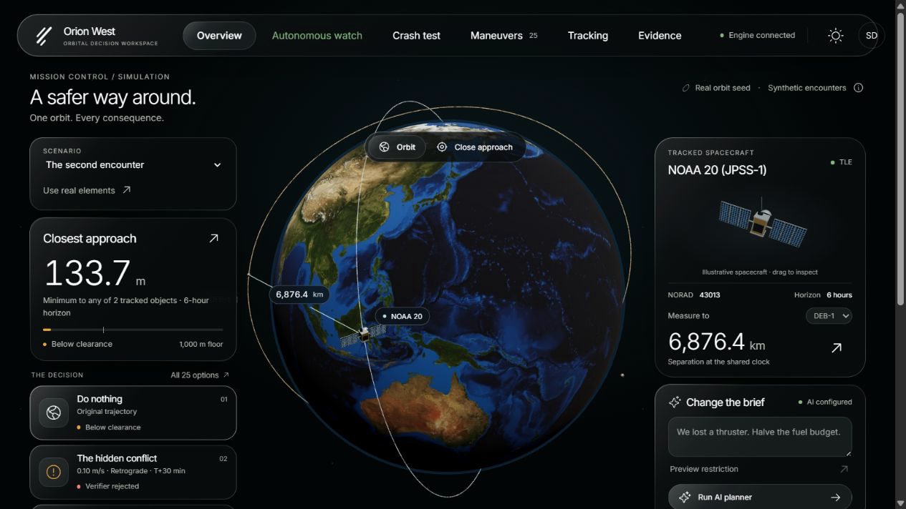
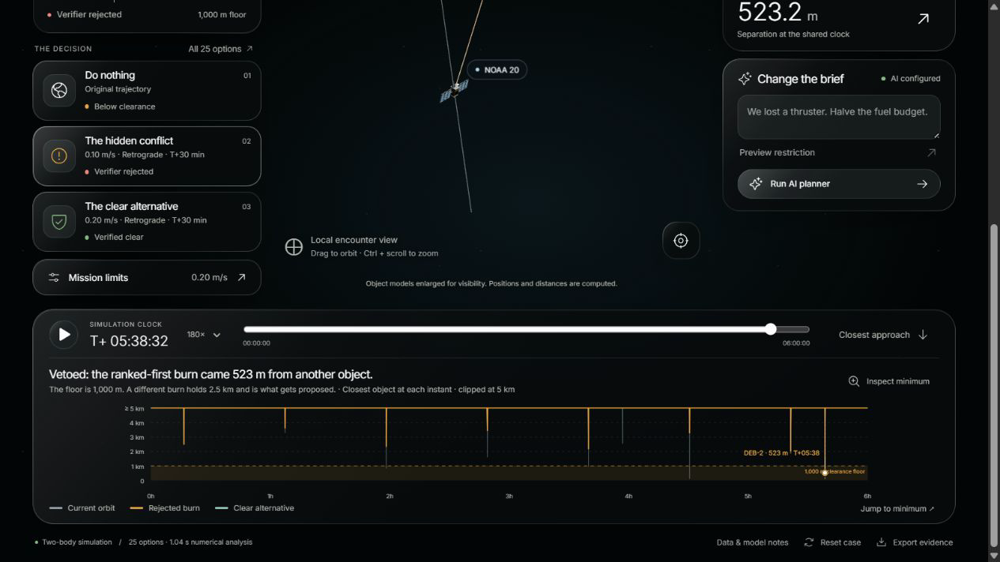
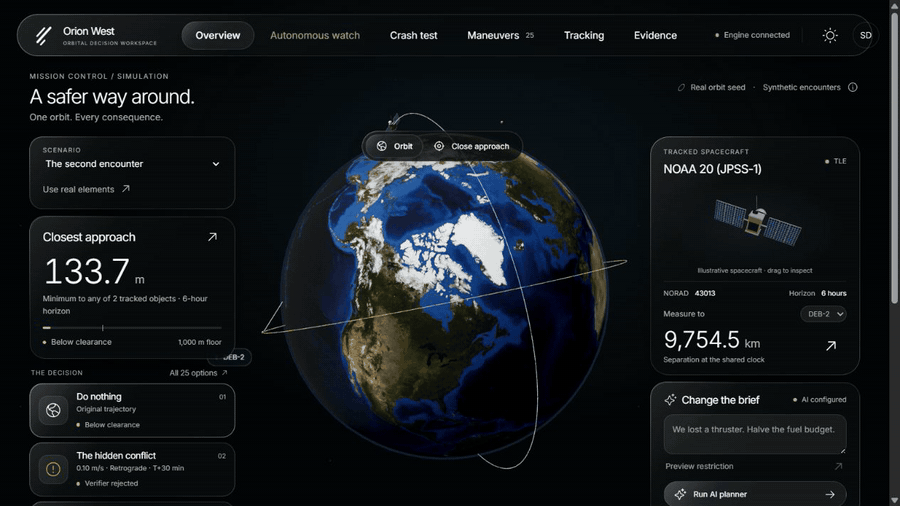
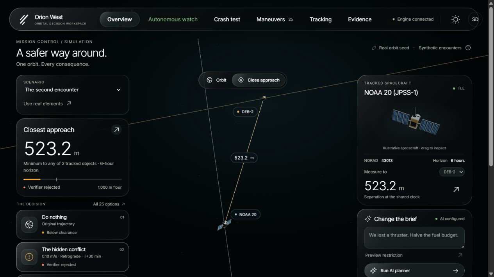
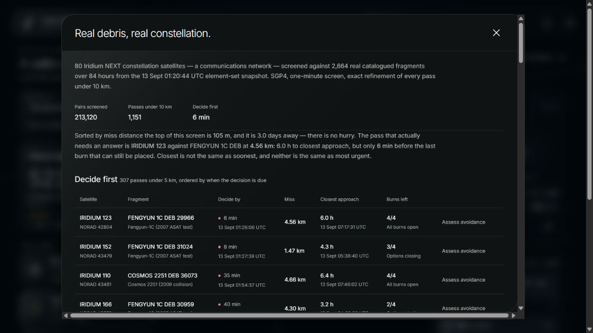
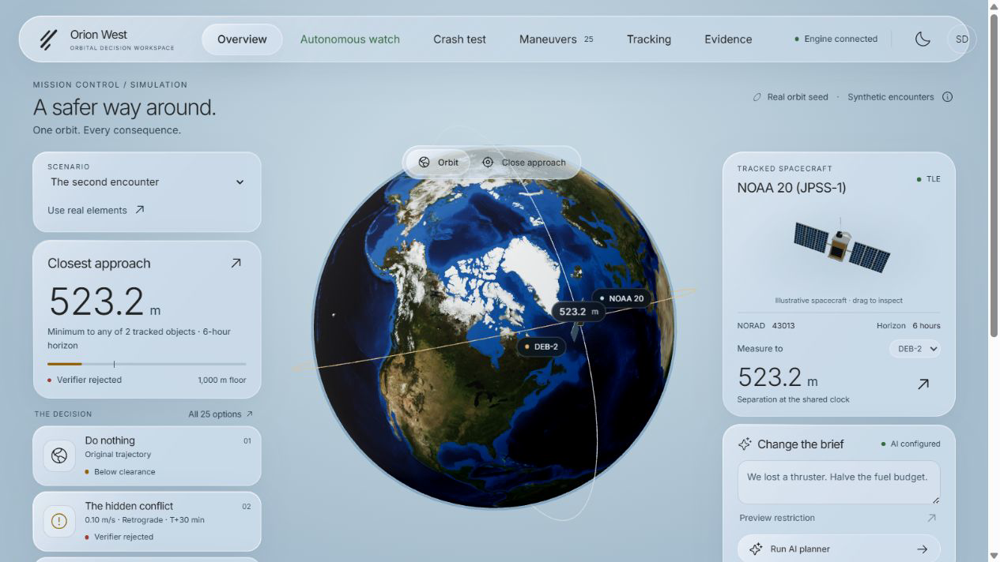
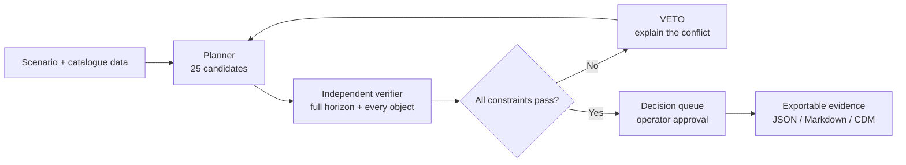

<div align="center">

# 🛰️ Orion West

### Autonomous orbital decisions with a hard safety veto.

Track real debris. Test the burn. Reject what fails. Show the evidence.

[](https://auenchanters-orionwest.hf.space)
[](https://huggingface.co/spaces/Auenchanters/Orionwest)
[](https://www.python.org/)
[](LICENSE)

<br />

**[Launch Orion West](https://auenchanters-orionwest.hf.space)** · **[Read the deployment notes](DEPLOY.md)** · **[Explore the evidence](Handoff/STATE.md)**

</div>

<p align="center">
  
</p>

<p align="center"><em>The deployed workspace: a decision is only useful when the operator can see why it survived.</em></p>

## The one-minute story

Orion West is a decision-making workspace for orbital conjunctions. It combines deterministic orbital mechanics with bounded AI agents, then puts an independent verifier between a recommendation and an approval.

1. **Find the near miss.** A real NOAA-20 orbit is placed in a verified demonstration encounter with debris.
2. **Try the cheapest answer.** The planner screens 25 manoeuvres. The cheapest option clears the first object, but creates a new 523 m conflict with a second object.
3. **Let the veto win.** The independent reviewer rejects that option. The next option holds 2.5 km of clearance. Halve the fuel budget and the system honestly reports `NO_APPROVABLE_OPTION`.

The point is not that an AI can suggest a burn. The point is that it cannot make an unsafe burn look approved.

## Why this is different

| Design decision | What the operator gets |
| --- | --- |
| **Veto-first safety** | Approvability is read from typed validation results. The model can recommend; it cannot approve. |
| **Independent verification** | A separate code path rebuilds the encounter from raw scenario data, uses a finer scan, and checks every object across the horizon. |
| **Evidence before prose** | Numbers shown in the UI come from backend evidence. Unsupported figures in an agent brief are flagged instead of trusted. |
| **Real tracking context** | The Tracking view screens an actual Iridium NEXT fleet against catalogued fragments from the Iridium 33 / Cosmos 2251 and Fengyun-1C events. |

## See the veto happen

<p align="center">
  
</p>

The first manoeuvre is attractive because it is cheap. It is rejected because it creates another close approach. That chain — proposal → independent scan → veto → safer alternative — is the core product, not a hidden implementation detail.

## A living orbital workspace

<p align="center">
  
</p>

The live workspace lets a judge rotate the globe, jump between exact encounters, play the shared clock, inspect the separation chart, compare all 25 options, change the fuel budget, trigger a replan, review evidence, and export a decision record.

<table>
  <tr>
    <td width="33%" align="center"><strong>Encounter</strong><br /><br /></td>
    <td width="33%" align="center"><strong>Tracking</strong><br /><br /></td>
    <td width="33%" align="center"><strong>Light mode</strong><br /><br /></td>
  </tr>
</table>

## Judge-ready proof

The values below come from repository tests, scripts, or the deployed application — not from a mock UI.

| Signal | Verified result |
| --- | --- |
| Candidate manoeuvres | 25 options screened and ranked |
| Safety veto | Cheapest candidate rejected after a 523 m secondary conflict |
| Surviving alternative | 2.5 km clearance in the same scenario |
| Real tracking screen | 80 Iridium NEXT satellites × 2,664 debris objects; 213,120 pairs; 1,151 passes under 10 km across 84 hours |
| External context check | Closest tracked pass: 105 m locally vs 48 m in a published SOCRATES record; closest-approach times differ by 0.03 s |
| Live hosted planner | `PROPOSAL_READY` with reviewer `ALLOW` in 4.5 s on GLM-5.3-Flash through Hugging Face |
| Live constrained replan | `NO_APPROVABLE_OPTION` after “halve the fuel budget” in 29.5 s |
| Automated regression coverage | 394 Python tests + 7 frontend unit tests |

The hosted AI path is intentionally labelled with its real latency. Orion West does not claim a ten-second replan target that the current model path does not meet.

## Try the live demo

Open **[auenchanters-orionwest.hf.space](https://auenchanters-orionwest.hf.space)**.

| Field | Demo value |
| --- | --- |
| Username | `Paan` |
| Password | `Banaras` |

This is a shared demonstration login for the public Space, not a private-account identity system. Nothing in the README is the server access token.

For a fast walkthrough, open **Autonomous watch** and let the six stages run: detect → AI triage → burn estimate → re-screen → safety review → coordination. The **Crash test** view shows the contrast between doing nothing and the verified burn; the explosion is illustrative and execution is simulated.

## What is real — and what is constructed

| Component | Status |
| --- | --- |
| NOAA-20 / JPSS-1 starting orbit, NORAD 43013 | **Real** — parsed from a committed CelesTrak element set |
| Iridium NEXT and collision-fragment tracking context | **Real** — committed catalogue data and CelesTrak SOCRATES context |
| Demonstration close approaches | **Synthetic** — constructed backward from an encounter, then verified by forward propagation |
| Spacecraft execution | **Simulated** — no command is transmitted to a spacecraft |
| Collision probability | **Not computed** — the product reports deterministic separation and exactly what was screened |

The orbit is realistic. The encounter is constructed. Orion West keeps those claims separate in the UI and in its exported records.

## How it works



The model is a bounded participant in the loop. It has tools for planning, reviewing, memory, and plain-English constraint changes, but typed backend results remain authoritative.

### Repository map

```text
backend/core/        propagation, trajectories, encounter detection
backend/planning/    candidate search, primary screening, independent verifier
backend/agent/       provider seam, planner, reviewer, tracker, autonomous watch
backend/tracking.py  SGP4-based catalogue screening
backend/api.py       HTTP surface, auth, approval, exports
frontend/            React + Three.js workspace
scenarios/           generated and asserted orbital fixtures
data/                committed catalogues and provenance records
```

## Run it locally

Requirements: Python 3.12+, Node.js 24, and an optional Hugging Face token for the live planner.

```bash
pip install -r requirements-dev.txt
npm --prefix frontend ci
npm --prefix frontend run build

python -m uvicorn backend.api:app --host 127.0.0.1 --port 8000
```

Open `http://127.0.0.1:8000`. The deterministic workflow runs without an API key. To enable the hosted model path, copy `.env.example` to `.env`, set `HF_TOKEN`, `PLANNER_MODEL`, and `REVIEWER_MODEL`, then run:

```bash
python scripts/smoke_llm.py
```

Useful checks:

```bash
python -m pytest tests -q
npm --prefix frontend test
python scripts/demo_pipeline.py
python scripts/diagnose.py
```

See [DEPLOY.md](DEPLOY.md) for Docker Space configuration and secret names. See [Handoff/STATE.md](Handoff/STATE.md) for the complete verification record, known limits, and live deployment evidence.

## License and attribution

Original Orion West code and documentation are released under the [Apache License 2.0](LICENSE). The repository also includes [NOTICE](NOTICE) with attribution boundaries for third-party material.

Third-party assets retain their own licenses: NASA Earth Observatory Blue Marble imagery, CelesTrak orbital data, Inter under the SIL Open Font License, Phosphor, and Three.js under the MIT License. See [frontend/ASSETS.md](frontend/ASSETS.md) and the provenance files for source and integrity details.

<div align="center">

Built for safer, more explainable orbital traffic management.

**[Launch the live workspace →](https://auenchanters-orionwest.hf.space)**

</div>
